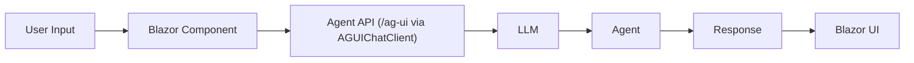
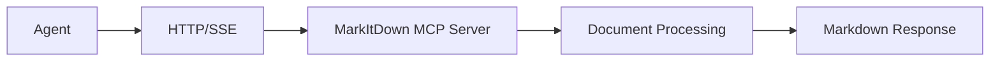
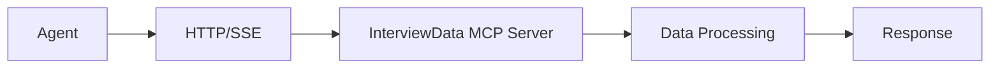
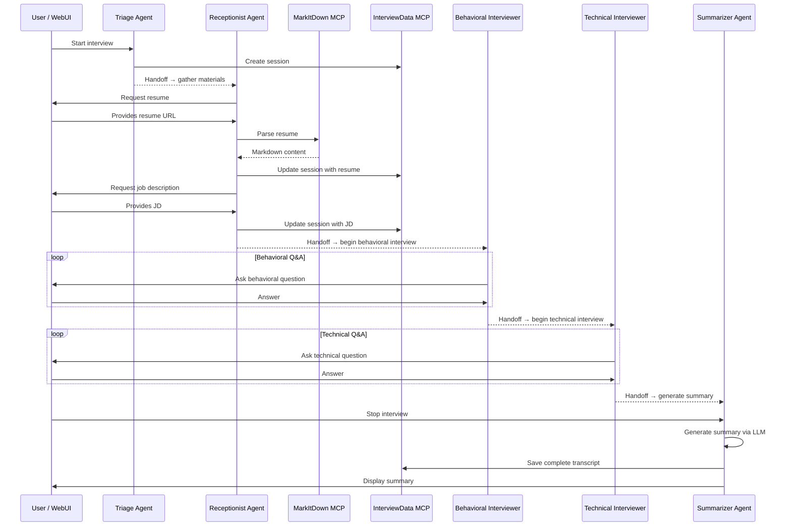

# Architecture overview

How the Interview Coach is put together and why.

## System architecture

[Aspire](https://aspire.dev) orchestrates the services: agent, web UI, MCP servers, and a SQLite database. Each runs as a separate process with service discovery wiring them together.

A few decisions shaped the design:

1. **MCP for tools** — Tools (document parsing, session storage) live in their own MCP servers. They can be reused across projects and developed independently.
2. **Provider abstraction** — The LLM backend is swappable at runtime: Foundry, Azure OpenAI, or GitHub Models.
3. **Aspire orchestration** — Service discovery, health checks, and telemetry come free from .NET Aspire.
4. **Stateful sessions** — Interview sessions persist to SQLite so users can pause and resume.

## Component Deep Dive

### 1. InterviewCoach.Agent (AI agent service)

The agent runs the interview. It decides what to ask, when to call tools, and how to respond.

Built on ASP.NET Core, Microsoft Agent Framework, and the OpenAI SDK. Talks to the web UI via the AG-UI protocol and to tools via MCP clients.

- Runs as a single agent or as 5 specialists in handoff mode (configurable)
- Has step-by-step interview instructions (scoped per-agent in handoff mode)
- Calls MarkItDown (document parsing) and InterviewData (session storage) through MCP
- Uses the `IChatClient` interface, so the LLM provider is pluggable

### 2. InterviewCoach.WebUI (user interface)

A Blazor web app where users chat with the agent. Styled with Tailwind CSS, renders markdown with Marked.js, and sanitizes input with DOMPurify. Communicates with the agent over the AG-UI protocol.

**Communication Flow**:

### 3. InterviewCoach.Mcp.MarkItDown (document parsing)

Converts PDFs, DOCX files, and other documents to markdown so the agent can read them. This is [Microsoft's MarkItDown](https://github.com/microsoft/markitdown) running as an MCP server in a Docker container.

It's external (Python-based) because it's reusable across projects and maintained independently. It also shows how to integrate a third-party MCP server.

**Integration Pattern**:

### 4. InterviewCoach.Mcp.InterviewData (session storage)

A custom .NET MCP server that stores interview sessions in SQLite via Entity Framework Core. Built with the `ModelContextProtocol.Server` SDK.

**Integration Pattern**:

### 5. InterviewCoach.AppHost (Aspire orchestration)

The Aspire app model. Defines which services exist, how they depend on each other, and what config they get.

### 6. InterviewCoach.ServiceDefaults (shared defaults)

OpenTelemetry, health checks, service discovery, and HTTP client defaults. Shared across all projects so you don't repeat the setup.

## Multi-Agent Handoff Workflow

## Next steps

- [Learning objectives](LEARNING-OBJECTIVES.md)
- [Tutorials](TUTORIALS.md)
- [FAQ](FAQ.md)
