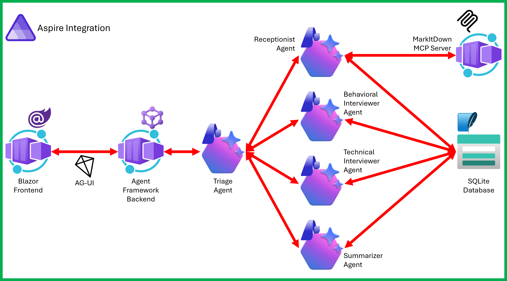

# Architecture Overview

This document provides a deep dive into the Interview Coach application architecture, explaining how components work together to create a production-ready AI agent system.

## System Architecture



The application follows a **microservices architecture** orchestrated by .NET Aspire, with clear separation between the AI agent, user interface, extensibility layer (MCP servers), and data persistence.

### Key Architectural Decisions

1. **MCP-Based Extensibility**: Tools are implemented as separate MCP servers rather than direct integrations, enabling reusability and independent development
2. **Provider Abstraction**: LLM provider is configurable at runtime, supporting Foundry, Azure OpenAI, and GitHub Models
3. **Aspire Orchestration**: Service discovery, health checks, and observability are built-in through .NET Aspire
4. **Stateful Sessions**: Interview sessions persist to SQLite, allowing resume/pause functionality

## Component Deep Dive

### 1. InterviewCoach.Agent (AI Agent Service)

**Purpose**: The core AI agent that conducts interviews, manages conversation flow, and orchestrates tool usage.

**Technology Stack**:

- Microsoft Agent Framework (`Microsoft.Agents.AI`)
- OpenAI SDK for chat completions
- MCP client for tool integration
- ASP.NET Core Web API

**Key Files**:

- **[Program.cs](../src/InterviewCoach.Agent/Program.cs)** - Application entry point and agent configuration
  - Lines 17-66: MCP client setup (MarkItDown and InterviewData)
  - Lines 68-79: LLM provider configuration
  - Lines 81-119: Agent definition with instructions and tools
  - Lines 121-135: API endpoint mapping (Responses, Conversations, AGUI)

**Agent Capabilities**:

```csharp
// Agent is configured with:
- Instructions: Step-by-step interview process
- Tools: MarkItDown (document parsing) + InterviewData (session management)
- Chat client: Provider-agnostic IChatClient interface
```

**API Endpoints**:

- `/responses` - OpenAI-compatible responses API
- `/conversations` - Multi-turn conversation management
- `/ag-ui` - Agent Framework DevUI integration
- `/devui/` - Development UI (dev environment only)

**Design Pattern**: The agent uses the **Instruction-Tool-Loop** pattern:

1. Receive user message
2. Follow instructions to determine next action
3. Call tools as needed
4. Generate response
5. Repeat

### 2. InterviewCoach.WebUI (User Interface)

**Purpose**: Blazor-based web application providing the user interface for interacting with the interview coach agent.

**Technology Stack**:

- Blazor Server
- Tailwind CSS for styling
- Marked.js for markdown rendering
- DOMPurify for XSS protection

**Key Files**:

- **[Program.cs](../src/InterviewCoach.WebUI/Program.cs)** - Web host configuration
- **[Components/Pages/Home.razor](../src/InterviewCoach.WebUI/Components/Pages/Home.razor)** - Main chat interface
- **[wwwroot/](../src/InterviewCoach.WebUI/wwwroot/)** - Static assets and client libraries

**Communication Flow**:

```
User Input → Blazor Component → Agent API (/conversations) → LLM → Agent → Response → Blazor UI
```

### 3. InterviewCoach.Mcp.MarkItDown (Document Parsing MCP Server)

**Purpose**: External MCP server that converts various document formats (PDF, DOCX, etc.) to markdown for agent consumption.

**Source**: [Microsoft MarkItDown](https://github.com/microsoft/markitdown)

**Why External?**:

- Language-agnostic (Python-based)
- Reusable across projects
- Independently maintained by Microsoft
- Demonstrates external MCP integration

**Tools Provided**:

- `convert_to_markdown` - Parse resumes and job descriptions

**Integration Pattern**:

```
Agent → HTTP/SSE → MarkItDown MCP Server → Document Processing → Markdown Response
```

### 4. InterviewCoach.Mcp.InterviewData (Custom MCP Server)

**Purpose**: Custom .NET MCP server managing interview session state and persistence.

**Technology Stack**:

- Model Context Protocol SDK (`ModelContextProtocol.Server`)
- Entity Framework Core with SQLite
- ASP.NET Core hosting

**Key Files**:

- **[Program.cs](../src/InterviewCoach.Mcp.InterviewData/Program.cs)** - MCP server setup
- **[InterviewSessionTool.cs](../src/InterviewCoach.Mcp.InterviewData/InterviewSessionTool.cs)** - Tool implementations
- **[InterviewDataDbContext.cs](../src/InterviewCoach.Mcp.InterviewData/InterviewDataDbContext.cs)** - EF Core context
- **[InterviewSessionRepository.cs](../src/InterviewCoach.Mcp.InterviewData/InterviewSessionRepository.cs)** - Data access layer

**Tools Provided**:

- `create_interview_session` - Initialize new session
- `get_interview_session` - Retrieve session by ID
- `update_interview_session` - Update session data
- Additional session management operations

**Why Custom MCP?**:

- Domain-specific logic (interview session management)
- Demonstrates how to build your own MCP servers
- Shows .NET MCP implementation patterns

**Database Schema**:

```
InterviewSession
├── SessionId (PK)
├── Resume (text)
├── JobDescription (text)
├── Transcript (JSON)
├── Status
├── CreatedAt
└── UpdatedAt
```

### 5. InterviewCoach.AppHost (Aspire Orchestration)

**Purpose**: .NET Aspire application model defining service topology, dependencies, and configuration.

**Key Files**:

- **[AppHost.cs](../src/InterviewCoach.AppHost/AppHost.cs)** - Service orchestration
- **[LlmResourceFactory.cs](../src/InterviewCoach.AppHost/LlmResourceFactory.cs)** - Provider abstraction
- **[ResourceConstants.cs](../src/InterviewCoach.AppHost/ResourceConstants.cs)** - Resource naming constants

**Service Topology**:

```csharp
SQLite Database
    ↓
MCP InterviewData Server (depends on SQLite)
    ↓
MarkItDown MCP Server (Docker)
    ↓
Agent Service (depends on both MCP servers + LLM provider)
    ↓
WebUI (depends on Agent)
```

**Dependency Management**:

- `.WaitFor()` ensures proper startup order
- `.WithReference()` provides service discovery
- External HTTP endpoints for development access

**LLM Provider Abstraction**:
The `LlmResourceFactory.WithLlmReference()` extension method:

1. Reads `LlmProvider` configuration
2. Retrieves provider-specific credentials
3. Creates appropriate OpenAI client configuration
4. Injects as dependency into agent service

Supports:

- **Microsoft Foundry**: Production AI service with model-router
- **Azure OpenAI**: Direct AOAI endpoint access
- **GitHub Models**: Free prototyping with GitHub-hosted models

### 6. InterviewCoach.ServiceDefaults (Shared Configuration)

**Purpose**: Common service configuration shared across all projects (observability, health checks, service discovery).

**Key Files**:

- **[Extensions.cs](../src/InterviewCoach.ServiceDefaults/Extensions.cs)** - Configuration extensions

**Provides**:

- OpenTelemetry setup
- Health check endpoints
- Service discovery configuration
- HTTP client defaults

## Data Flow

### Typical Interview Flow

```
1. User opens WebUI
   ↓
2. WebUI → Agent: "Start interview"
   ↓
3. Agent → InterviewData MCP: Create session
   ↓
4. Agent → User: Request resume
   ↓
5. User → Agent: Provides resume URL
   ↓
6. Agent → MarkItDown MCP: Parse resume
   ↓
7. MarkItDown → Agent: Markdown content
   ↓
8. Agent → InterviewData MCP: Update session with resume
   ↓
9. Agent → User: Request job description
   ↓
10. User → Agent: Provides JD
    ↓
11. Agent → InterviewData MCP: Update session
    ↓
12. Agent → User: Begin behavioral questions
    ↓
13. [Question/Answer loop with LLM]
    ↓
14. Agent → User: Switch to technical questions
    ↓
15. [Question/Answer loop continues]
    ↓
16. User: Stop interview
    ↓
17. Agent → LLM: Generate summary
    ↓
18. Agent → InterviewData MCP: Save complete transcript
    ↓
19. Agent → User: Display summary
```

## Design Patterns

### 1. **Agent Pattern**

The AI agent acts as an orchestrator with:

- Clear instructions defining behavior
- Tools for capabilities beyond generation
- State management for context

### 2. **Model Context Protocol (MCP) Pattern**

Tools are external services communicating via MCP:

- Language-agnostic interface
- Versioned tool schemas
- Independent deployment and scaling

### 3. **Provider Abstraction Pattern**

LLM provider is abstracted through:

- Configuration-driven selection
- Common `IChatClient` interface
- Runtime provider switching

### 4. **Repository Pattern**

Database access is abstracted:

- `IInterviewSessionRepository` interface
- EF Core implementation
- Enables testing and alternative storage

### 5. **Orchestrator Pattern**

Aspire acts as conductor:

- Declarative service topology
- Dependency injection
- Configuration management

## Configuration Management

### Configuration Hierarchy

```
1. appsettings.json (defaults)
   ↓
2. apphost.settings.json (Aspire-specific)
   ↓
3. User secrets (local dev credentials)
   ↓
4. Environment variables (deployment)
```

### LLM Provider Configuration

**Foundry** (Production):

```json
{
  "LlmProvider": "MicrosoftFoundry",
  "MicrosoftFoundry": {
    "Project": {
      "Endpoint": "{{MICROSOFT_FOUNDRY_PROJECT_ENDPOINT}}",
      "ApiKey": "{{MICROSOFT_FOUNDRY_PROJECT_API_KEY}}",
      "DeploymentName": "model-router"
    }
  }
}
```

**Azure OpenAI**:

```json
{
  "LlmProvider": "AzureOpenAI",
  "Azure": {
    "OpenAI": {
      "Endpoint": "{{AZURE_OPENAI_ENDPOINT}}",
      "ApiKey": "{{AZURE_OPENAI_API_KEY}}",
      "DeploymentName": "gpt-4o"
    }
  }
}
```

**GitHub Models** (Development):

```json
{
  "LlmProvider": "GitHubModels",
  "GitHub": {
    "Token": "{{GITHUB_PAT}}",
    "Model": "openai/gpt-4o-mini"
  }
}
```

## Deployment Architecture

### Local Development

```
┌─────────────────────────────────────────┐
│ Aspire Dashboard                        │
│ (localhost:15xxx)                       │
└─────────────────────────────────────────┘
         ↓
┌─────────────────────────────────────────┐
│ Services (all localhost)                │
│ - WebUI                                 │
│ - Agent                                 │
│ - MarkItDown MCP (Docker)               │
│ - InterviewData MCP                     │
│ - SQLite (file-based)                   │
└─────────────────────────────────────────┘
```

### Azure Deployment (via azd)

```
┌─────────────────────────────────────────┐
│ Azure Container Apps                    │
│ - WebUI Container                       │
│ - Agent Container                       │
│ - MCP Servers (containers)              │
└─────────────────────────────────────────┘
         ↓
┌─────────────────────────────────────────┐
│ Azure Resources                         │
│ - Container Apps Environment            │
│ - Azure Storage (SQLite alternative)    │
│ - Microsoft Foundry Connection          │
│ - Log Analytics                         │
└─────────────────────────────────────────┘
```

## Observability

Built-in through .NET Aspire:

- **Logs**: Structured logging to console/Log Analytics
- **Traces**: Distributed tracing with OpenTelemetry
- **Metrics**: Service health, request counts, latencies
- **Dashboard**: Real-time monitoring during development

## Security Considerations

1. **API Keys**: Stored in user secrets (dev) or Azure Key Vault (prod)
2. **Input Validation**: DOMPurify sanitizes user input in WebUI
3. **HTTPS**: Required in production (enforced by container apps)
4. **CORS**: Configured for WebUI-to-Agent communication
5. **Agent Instructions**: Constrained to interview domain

## Scalability Patterns

- **Stateless Agent**: Can scale horizontally (state in database)
- **MCP Servers**: Independent scaling based on demand
- **SQLite → Azure SQL**: Upgrade path for production scale
- **Container Apps**: Auto-scaling based on HTTP queue length

## Extension Points

To customize this sample:

1. **Add MCP Tools**: Create new MCP servers for capabilities
2. **Modify Agent Instructions**: Change interview flow/questions
3. **Swap UI**: Replace Blazor with React/Vue
4. **Enhanced Storage**: Switch from SQLite to Cosmos DB
5. **Multi-Agent**: Add specialist agents (technical, behavioral)

## Next Steps

- 📖 [Learning Objectives](LEARNING-OBJECTIVES.md) - Understand what you'll learn
- 🛠️ [MCP Servers Guide](MCP-SERVERS.md) - Deep dive into extensibility
- 📚 [Tutorials](TUTORIALS.md) - Hands-on modifications

---

For questions about the architecture, see [FAQ.md](FAQ.md) or open an issue on GitHub.
