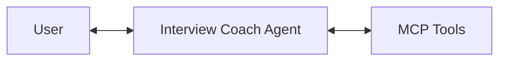
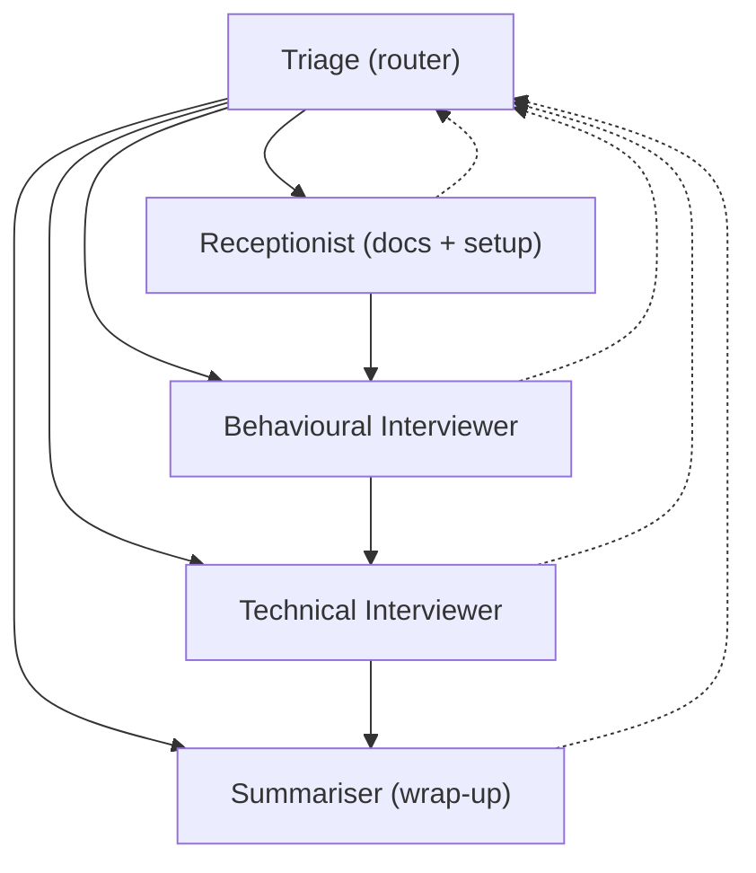

# Multi-agent architecture

This project shows three ways to build the interview coach with [Microsoft Agent Framework](https://aka.ms/agent-framework). All three are implemented in `src/InterviewCoach.Agent/AgentDelegateFactory.cs` and switchable via config.

## Overview

| Mode               | Approach                             | Agent Count | LLM Backend                            | Best For                               |
|--------------------|--------------------------------------|-------------|----------------------------------------|----------------------------------------|
| **Single**         | Single Agent                         | 1           | Foundry / Azure OpenAI / GitHub Models | Simple deployments, getting started    |
| **LlmHandOff**     | Multi-Agent Handoff (LLM)            | 5           | Foundry / Azure OpenAI / GitHub Models | Production multi-agent with cloud LLMs |
| **CopilotHandOff** | Multi-Agent Handoff (GitHub Copilot) | 5           | GitHub Copilot                         | Local development with Copilot         |

## How to switch modes

The agent mode is controlled by the `AgentMode` setting in `apphost.settings.json`:

```json
{
  // Mode 1: Single agent
  "AgentMode": "Single",

  // Mode 2: Multi-agent handoff (LLM)
  "AgentMode": "LlmHandOff",

  // Mode 3: Multi-agent handoff (GitHub Copilot)
  "AgentMode": "CopilotHandOff"
}
```

You can also pass the mode as a CLI argument:

```bash
# Mode 1: Single agent
aspire run --file ./apphost.cs -- --mode Single

# Mode 2: Multi-agent handoff (LLM)
aspire run --file ./apphost.cs -- --mode LlmHandOff

# Mode 3: Multi-agent handoff (GitHub Copilot)
aspire run --file ./apphost.cs -- --mode CopilotHandOff
```

## Mode 1: Single agent

The simplest setup — one `ChatClientAgent` does everything.



The agent has a comprehensive instruction prompt covering session management, document intake, behavioural questions, technical questions, and summarization. All MCP tools (MarkItDown + InterviewData) are available to the single agent.
See `CreateSingleAgent()` in [AgentDelegateFactory.cs](../src/InterviewCoach.Agent/AgentDelegateFactory.cs).

Good for getting started or when you don't need multi-agent complexity.

## Mode 2: Multi-agent handoff (LLM provider)

Splits the coach into 5 specialized agents connected via the [handoff pattern](https://learn.microsoft.com/en-us/agent-framework/workflows/orchestrations/handoff).

### What is handoff?

In the handoff pattern, one agent transfers full control of the conversation to another. Unlike "agent-as-tools" (where a primary agent calls others as helpers), the receiving agent takes over entirely. This fits the interview flow well because each phase has its own job.

### Agent topology



**Triage** is the entry point and fallback. The happy-path flow is sequential: Receptionist → Behavioural Interviewer → Technical Interviewer → Summariser. Each specialist hands off directly to the next agent in sequence. Specialists can fall back to Triage for out-of-order requests.

### The 5 agents

| Agent                                                   | Role                                                | MCP Tools                  |
|---------------------------------------------------------|-----------------------------------------------------|----------------------------|
| **Triage** (`triage`)                                   | Routes messages to the right specialist             | None (pure routing)        |
| **Receptionist** (`receptionist`)                       | Creates sessions, collects resume & job description | MarkItDown + InterviewData |
| **Behavioural Interviewer** (`behavioural_interviewer`) | Conducts behavioural questions using STAR method    | InterviewData              |
| **Technical Interviewer** (`technical_interviewer`)     | Conducts technical questions for the role           | InterviewData              |
| **Summariser** (`summariser`)                           | Generates comprehensive interview summary           | InterviewData              |

### How it works in code

Each agent is a `ChatClientAgent` with scoped instructions and tools:

```csharp
var triageAgent = new ChatClientAgent(
    chatClient: chatClient,
    name: "triage",
    instructions: "You are the Triage agent. Route messages to the right specialist...");

var receptionistAgent = new ChatClientAgent(
    chatClient: chatClient,
    name: "receptionist",
    instructions: "You are the Receptionist. Set up sessions and collect documents...",
    tools: [.. markitdownTools, .. interviewDataTools]);
```

The handoff workflow uses a **sequential chain** topology with Triage as fallback. Each specialist hands off directly to the next phase (not back to Triage), preventing re-routing loops:

```csharp
var workflow = AgentWorkflowBuilder
               .CreateHandoffBuilderWith(triageAgent)
               .WithHandoffs(triageAgent, [receptionistAgent, behaviouralAgent, technicalAgent, summariserAgent])
               .WithHandoffs(receptionistAgent, [behaviouralAgent, triageAgent])
               .WithHandoffs(behaviouralAgent, [technicalAgent, triageAgent])
               .WithHandoffs(technicalAgent, [summariserAgent, triageAgent])
               .WithHandoff(summariserAgent, triageAgent)
               .Build();

return workflow;
```

Good for production scenarios where you want specialized agents with a cloud LLM.

## Mode 3: Multi-agent handoff (GitHub Copilot)

Same 5-agent topology as Mode 2, but backed by the GitHub Copilot SDK instead of a cloud LLM.

### How it differs from Mode 2

| Aspect         | Mode 2 (LLM)                                           | Mode 3 (GitHub Copilot)                  |
|----------------|--------------------------------------------------------|------------------------------------------|
| Agent creation | `new ChatClientAgent(chatClient, ...)`                 | `copilotClient.AsAIAgent(...)`           |
| LLM backend    | Cloud provider (Foundry/Azure OpenAI/GitHub Models)    | GitHub Copilot                           |
| Configuration  | Requires LLM provider setup in `apphost.settings.json` | Requires `GitHubCopilot:Token` in config |
| Tool passing   | `AITool` instances from MCP clients                    | Same `AITool` instances                  |

### How it works in code

```csharp
// Create the Copilot client and start it
var copilotClient = new CopilotClient();
await copilotClient.StartAsync();

var triageAgent = copilotClient.AsAIAgent(
    name: "triage",
    instructions: "You are the Triage agent...");

var receptionistAgent = copilotClient.AsAIAgent(
    name: "receptionist",
    instructions: "You are the Receptionist...",
    tools: [.. markitdownTools, .. interviewDataTools]);

// Same sequential-chain handoff workflow as Mode 2
var workflow = AgentWorkflowBuilder
               .CreateHandoffBuilderWith(triageAgent)
               .WithHandoffs(triageAgent, [receptionistAgent, behaviouralAgent, technicalAgent, summariserAgent])
               .WithHandoffs(receptionistAgent, [behaviouralAgent, triageAgent])
               .WithHandoffs(behaviouralAgent, [technicalAgent, triageAgent])
               .WithHandoffs(technicalAgent, [summariserAgent, triageAgent])
               .WithHandoff(summariserAgent, triageAgent)
               .Build();

return workflow.SetName(key);
```

Good for local dev when you have GitHub Copilot but don't want to set up a cloud LLM.

## Key concepts

### Tool scoping

Each agent only gets the MCP tools it needs:

- **Triage**: No tools (pure routing via handoff)
- **Receptionist**: MarkItDown (document parsing) + InterviewData (session management)
- **Interviewers**: InterviewData only (read/update sessions and transcripts)
- **Summariser**: InterviewData only (read sessions, mark complete)

This follows the principle of least privilege — agents can only access what they need.

### Shared session state

All agents share the same interview session through the InterviewData MCP server. The session (resume, job description, transcript) lives in SQLite and every agent accesses it through MCP tool calls. No agent touches the database directly.

### Handoff vs. agent-as-tools

| Pattern | Control | Context | Use Case |
|---------|---------|---------|----------|
| **Handoff** | Full transfer — receiving agent owns the conversation | Shared via handoff context | Distinct phases with specialized expertise |
| **Agent-as-Tools** | Central agent retains control, calls others as helpers | Central agent manages context | Helper agents for specific sub-tasks |

This project uses **handoff** because the interview flow has clear phases (intake → behavioural → technical → summary) where each specialist should fully own the conversation during their phase.

## Resources

- [Microsoft Agent Framework — Multi-agent Orchestrations](https://learn.microsoft.com/agent-framework/workflows/orchestrations/)
- [Microsoft Agent Framework — Handoff Orchestration](https://learn.microsoft.com/agent-framework/workflows/orchestrations/handoff)
- [GitHub Copilot Agent Provider](https://learn.microsoft.com/agent-framework/agents/providers/github-copilot)
- [Agent Framework Samples — Workflows](https://github.com/microsoft/Agent-Framework-Samples/tree/main/07.Workflow)
