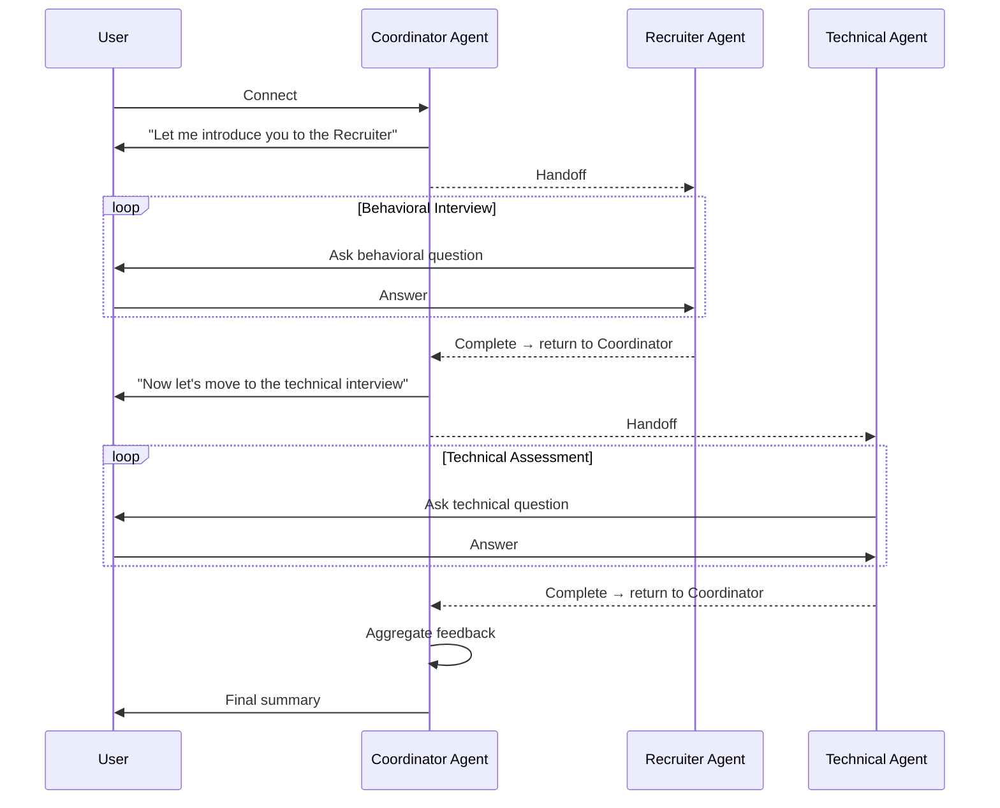

# Tutorials

These hands-on tutorials guide you through customizing and extending the Interview Coach application. Work through them sequentially to build understanding.

## Prerequisites

Before starting:

- Complete the [Getting Started](../README.md#getting-started) setup
- Get the app running locally
- Skim the [architecture overview](ARCHITECTURE.md)
- Basic familiarity with C# and .NET

---

## Tutorial 1: Understanding the Interview Flow

**Goal**: Trace how the interview process works from user input to agent response.

**Duration**: 20 minutes

### Step 1: Read the Agent Instructions

Open [src/InterviewCoach.Agent/AgentDelegateFactory.cs](../src/InterviewCoach.Agent/AgentDelegateFactory.cs) and find the `CreateSingleAgent` method:

```csharp
instructions: """
    You are an AI Interview Coach designed to help users prepare for job interviews.
    ...
    Here's the overall process you should follow:
    01. Start by fetching an existing interview session...
    02. If there's no existing session, create a new interview session...
    ...
    """
```

**Exercise**: Identify the key steps in the interview process. Notice:

- Session management comes first
- Resume/JD collection is optional
- Behavioral questions before technical
- User can stop at any time

### Step 2: Trace Tool Usage

The agent is configured with tools from two MCP servers:

```csharp
var markitdownTools = markitdown.ListToolsAsync().GetAwaiter().GetResult();
var interviewDataTools = interviewData.ListToolsAsync().GetAwaiter().GetResult();

var agent = new ChatClientAgent(
    chatClient: chatClient,
    name: key,
    instructions: """ ... """,
    tools: [ .. markitdownTools, .. interviewDataTools ]
);
```

**Exercise**:

1. Start the application
2. Open Aspire Dashboard (the URL appears in terminal)
3. Navigate to Agent logs
4. Start an interview conversation
5. Watch the logs to see when tools are called

You should see entries like:

```
info: Calling tool: add_interview_session
info: Tool response: {"id": "..."}
```

### Step 3: Examine Session State

The agent maintains state through the InterviewData MCP server:

1. Open [src/InterviewCoach.Mcp.InterviewData/InterviewSessionTool.cs](../src/InterviewCoach.Mcp.InterviewData/InterviewSessionTool.cs)
2. Find the `UpdateInterviewSessionAsync` method
3. See how it stores resume, job description, and transcript

**Exercise**:

1. Complete a short interview
2. Check the SQLite database using Aspire's SQLite Web viewer
3. Find your session record
4. Examine the stored transcript JSON

### Step 4: Modify the Interview Flow

Let's add a warmup message before behavioral questions.

**Edit** [src/InterviewCoach.Agent/AgentDelegateFactory.cs](../src/InterviewCoach.Agent/AgentDelegateFactory.cs):

Find this line:

```csharp
07. Once you have updated the session record with the information, begin the interview by asking behavioral questions first.
```

Change to:

```csharp
07. Once you have updated the session record with the information, first provide a brief warmup message encouraging the user, then begin the interview by asking behavioral questions first.
```

**Test**:

1. Restart the application
2. Start a new interview
3. Notice the warmup message before questions begin

**Reflection**: How does changing instructions affect agent behavior without code changes?

---

## Tutorial 2: Creating a Custom MCP Server

**Goal**: Build a simple MCP server that provides interview tips.

**Duration**: 45 minutes

### Step 1: Create New Project

```bash
cd src
dotnet new web -n InterviewCoach.Mcp.Tips
cd InterviewCoach.Mcp.Tips
dotnet add package ModelContextProtocol.Server
dotnet add package Microsoft.Extensions.Hosting
```

### Step 2: Create a Simple Tool

Create `InterviewTipsTool.cs`:

```csharp
using System.ComponentModel;
using ModelContextProtocol.Server;

[McpServerToolType]
public class InterviewTipsTool
{
    private static readonly Dictionary<string, string> Tips = new()
    {
        ["behavioral"] = "Use the STAR method: Situation, Task, Action, Result",
        ["technical"] = "Think out loud. Explain your reasoning as you solve problems",
        ["general"] = "Prepare questions for the interviewer. Show genuine interest"
    };

    [McpServerTool(Name = "get_interview_tip", Title = "Get an interview tip")]
    [Description("Get a helpful interview tip by category (behavioral, technical, or general).")]
    public string GetInterviewTip(
        [Description("Tip category: behavioral, technical, or general")] string category
    )
    {
        return Tips.GetValueOrDefault(category, Tips["general"]);
    }
}
```

### Step 3: Setup Program.cs

```csharp
using System.Reflection;

var builder = WebApplication.CreateBuilder(args);

builder.Services.AddMcpServer()
                .WithHttpTransport(o => o.Stateless = true)
                .WithToolsFromAssembly(Assembly.GetEntryAssembly());

var app = builder.Build();

app.MapMcp("/mcp");

await app.RunAsync();
```

### Step 4: Register in AppHost

Edit [src/InterviewCoach.Agent/Program.cs](../src/InterviewCoach.Agent/Program.cs):

Add after other MCP servers:

```csharp
var mcpTips = builder.AddProject<Projects.InterviewCoach_Mcp_Tips>("mcp-tips")
                     .WithExternalHttpEndpoints();
```

Update agent reference:

```csharp
var agent = builder.AddProject<Projects.InterviewCoach_Agent>(ResourceConstants.Agent)
                   .WithExternalHttpEndpoints()
                   .WithLlmReference(builder.Configuration, args)
                   .WithEnvironment(ResourceConstants.LlmProvider, builder.Configuration[ResourceConstants.LlmProvider] ?? string.Empty)
                   .WithReference(mcpMarkItDown.GetEndpoint("http"))
                   .WithReference(mcpInterviewData)
                   .WithReference(mcpTips)  // Add this line
                   .WaitFor(mcpMarkItDown)
                   .WaitFor(mcpInterviewData)
                   .WaitFor(mcpTips);  // Add this line
```

### Step 5: Connect from Agent

Edit [src/InterviewCoach.Agent/Program.cs](../src/InterviewCoach.Agent/Program.cs):

Add HTTP client:

```csharp
builder.Services.AddHttpClient("mcp-tips", client =>
{
    client.BaseAddress = new Uri("https+http://mcp-tips");
});
```

Add MCP client:

```csharp
builder.Services.AddKeyedSingleton<McpClient>("mcp-tips", (sp, obj) =>
{
    var loggerFactory = sp.GetRequiredService<ILoggerFactory>();
    var httpClient = sp.GetRequiredService<IHttpClientFactory>().CreateClient("mcp-tips");
    
    var clientTransportOptions = new HttpClientTransportOptions()
    {
        Endpoint = new Uri($"{httpClient.BaseAddress!.ToString().Replace("+http", string.Empty).TrimEnd('/')}/mcp")
    };
    var clientTransport = new HttpClientTransport(clientTransportOptions, httpClient, loggerFactory);
    
    var clientOptions = new McpClientOptions()
    {
        ClientInfo = new Implementation()
        {
            Name = "MCP Tips Client",
            Version = "1.0.0",
        }
    };
    
    return McpClient.CreateAsync(clientTransport, clientOptions, loggerFactory).GetAwaiter().GetResult();
});
```

Register tools with agent:

```csharp
var markitdown = sp.GetRequiredKeyedService<McpClient>("mcp-markitdown");
var interviewData = sp.GetRequiredKeyedService<McpClient>("mcp-interview-data");
var tips = sp.GetRequiredKeyedService<McpClient>("mcp-tips");  // Add this

var markitdownTools = markitdown.ListToolsAsync().GetAwaiter().GetResult();
var interviewDataTools = interviewData.ListToolsAsync().GetAwaiter().GetResult();
var tipsTools = tips.ListToolsAsync().GetAwaiter().GetResult();  // Add this

var agent = new ChatClientAgent(
    chatClient: chatClient,
    name: key,
    instructions: """ ... """,
    tools: [ .. markitdownTools, .. interviewDataTools, .. tipsTools ]  // Add tipsTools
);
```

### Step 6: Update Agent Instructions

Add to the agent instructions:

```csharp
instructions: """
    You are an AI Interview Coach...
    ...
    Use the provided tools to manage interview sessions, capture resume and job description, 
    ask questions, analyze responses, provide interview tips when appropriate, and generate summaries.
    ...
    """
```

### Step 7: Test

1. Restart the application
2. During an interview, ask: "Can you give me a tip for behavioral questions?"
3. The agent should call `get_interview_tip` with category "behavioral"

**Challenge**: Add more tips to the dictionary and enhance the tool to return multiple tips.

---

## Tutorial 3: Customizing the Agent

**Goal**: Modify agent behavior to focus on a specific job type.

**Duration**: 30 minutes

### Scenario: Technical Interview for Backend Developers

### Step 1: Update Agent Instructions

Edit [src/InterviewCoach.Agent/AgentDelegateFactory.cs](../src/InterviewCoach.Agent/AgentDelegateFactory.cs):

Find the `CreateSingleAgent` method and change the opening:

```csharp
instructions: """
    You are an AI Interview Coach specializing in backend software engineering positions.
    You will guide users through technical interview preparation with a focus on:
    - System design and architecture
    - API design and REST principles
    - Database modeling and optimization
    - Microservices and distributed systems
    - Algorithm and data structure fundamentals
    
    ...
    """
```

### Step 2: Modify Question Types

Change the question flow in `AgentDelegateFactory.cs`:

```csharp
07. Once you have updated the session record with the information, begin the interview with 
    system design questions first (2-3 questions).
08. After system design, move to algorithm and data structures questions (2-3 questions).
09. Finally, ask about specific backend technologies mentioned in the job description.
10. Before switching categories, ask the user if they want to continue to the next section.
```

### Step 3: Add Domain Expertise

Include specific context:

```csharp
When asking system design questions, focus on:
- Scalability patterns (load balancing, caching, sharding)
- Data consistency models (CAP theorem, eventual consistency)
- API versioning strategies
- Authentication/authorization patterns

When asking algorithm questions:
- Start with problem clarification
- Encourage the user to explain their approach
- Ask about time and space complexity
- Discuss optimization opportunities
```

### Step 4: Test

1. Restart the application
2. Start an interview with a backend job description
3. Notice the changed question types and focus

**Extension**: Create different agent profiles for frontend, data science, or DevOps roles.

---

## Tutorial 4: Multi-Agent Pattern

**Goal**: Understand how to extend to multiple specialized agents.

**Duration**: 45 minutes (conceptual + starter code)

### The Pattern

Instead of one general interview coach, create:

- **Recruiter Agent**: Screens candidates, asks behavioral questions
- **Technical Agent**: Conducts technical assessment
- **Coordinator Agent**: Manages the flow between agents

### Step 1: Define Agent Roles

Create `src/InterviewCoach.Agent/AgentRoles.cs`:

```csharp
public static class AgentRoles
{
    public const string Coordinator = "coordinator";
    public const string Recruiter = "recruiter";
    public const string Technical = "technical";
}
```

### Step 2: Create Specialized Instructions

```csharp
public static class AgentInstructions
{
    public static string GetInstructions(string role) => role switch
    {
        AgentRoles.Recruiter => """
            You are a friendly HR recruiter conducting the initial screening.
            Focus on:
            - Cultural fit and soft skills
            - Communication ability
            - Motivation and interest in the role
            - Work history and experience alignment
            
            Ask 3-5 behavioral questions using the STAR framework.
            After completing your questions, hand off to the technical interviewer.
            """,
            
        AgentRoles.Technical => """
            You are a senior engineer conducting the technical interview.
            Focus on:
            - Technical problem-solving ability
            - System design thinking
            - Code quality and best practices
            - Technology depth
            
            Conduct 2-3 technical assessments.
            After completing, provide your assessment to the coordinator.
            """,
            
        AgentRoles.Coordinator => """
            You coordinate the interview process.
            - Welcome the candidate
            - Introduce them to the recruiter agent
            - After recruiting, transition to technical agent
            - Collect feedback from both agents
            - Provide final summary
            """,
            
        _ => throw new ArgumentException($"Unknown role: {role}")
    };
}
```

### Step 3: Register Multiple Agents

Modify `Program.cs`:

```csharp
// Register coordinator agent
builder.AddAIAgent(
    name: AgentRoles.Coordinator,
    createAgentDelegate: (sp, key) => CreateAgent(sp, key, AgentRoles.Coordinator)
);

// Register recruiter agent
builder.AddAIAgent(
    name: AgentRoles.Recruiter,
    createAgentDelegate: (sp, key) => CreateAgent(sp, key, AgentRoles.Recruiter)
);

// Register technical agent
builder.AddAIAgent(
    name: AgentRoles.Technical,
    createAgentDelegate: (sp, key) => CreateAgent(sp, key, AgentRoles.Technical)
);

static ChatClientAgent CreateAgent(IServiceProvider sp, string key, string role)
{
    var chatClient = sp.GetRequiredService<IChatClient>();
    var markitdown = sp.GetRequiredKeyedService<McpClient>("mcp-markitdown");
    var interviewData = sp.GetRequiredKeyedService<McpClient>("mcp-interview-data");
    
    var tools = new List<Tool>();
    tools.AddRange(markitdown.ListToolsAsync().GetAwaiter().GetResult());
    tools.AddRange(interviewData.ListToolsAsync().GetAwaiter().GetResult());
    
    return new ChatClientAgent(
        chatClient: chatClient,
        name: key,
        instructions: AgentInstructions.GetInstructions(role),
        tools: tools
    );
}
```

### Step 4: Agent Handoff Pattern (Conceptual)

The coordinator would handle transitions:



**Note**: Full multi-agent orchestration requires additional workflow management. See [Microsoft Agent Framework Orchestrations](https://learn.microsoft.com/agent-framework/user-guide/workflows/orchestrations/overview) for advanced patterns.

---

## Tutorial 5: Adding Evaluation and Feedback

**Goal**: Enhance the agent to provide structured feedback scoring.

**Duration**: 30 minutes

### Step 1: Create Evaluation Schema

Create `src/InterviewCoach.Mcp.InterviewData/Models/Evaluation.cs`:

```csharp
public class InterviewEvaluation
{
    public string SessionId { get; set; } = string.Empty;
    public int CommunicationScore { get; set; }  // 1-10
    public int TechnicalScore { get; set; }      // 1-10
    public int ProblemSolvingScore { get; set; } // 1-10
    public List<string> Strengths { get; set; } = new();
    public List<string> AreasForImprovement { get; set; } = new();
    public string OverallRecommendation { get; set; } = string.Empty;
}
```

### Step 2: Add Evaluation Tool to MCP Server

```csharp
using System.ComponentModel;
using ModelContextProtocol.Server;

[McpServerToolType]
public class EvaluationTool(IInterviewSessionRepository repository)
{
    [McpServerTool(Name = "save_interview_evaluation", Title = "Save interview evaluation")]
    [Description("Save structured evaluation scores and feedback for an interview session.")]
    public async Task<InterviewEvaluation> SaveEvaluationAsync(
        [Description("The evaluation data")] InterviewEvaluation evaluation
    )
    {
        await repository.SaveEvaluationAsync(evaluation);
        return evaluation;
    }
}
```

### Step 3: Update Agent Instructions

```csharp
11. After the interview is complete, generate a comprehensive evaluation including:
    - Communication score (1-10)
    - Technical score (1-10)
    - Problem-solving score (1-10)
    - List of strengths (3-5 items)
    - Areas for improvement (3-5 items)
    - Overall hiring recommendation
12. Save the evaluation using the save_interview_evaluation tool.
13. Present the evaluation to the user in a friendly, encouraging format.
```

---

## Next Steps

After these tutorials you should be able to:

- Change agent behavior by editing instructions
- Build a custom MCP server with tools
- Understand multi-agent handoff patterns
- Add structured evaluation logic

### More things to try

1. **Voice input** — integrate speech-to-text for realistic practice
2. **Timer** — add an MCP tool to track time per question
3. **Question bank** — MCP server with curated questions by role/level
4. **Video analysis** — MCP server for facial expression feedback (advanced)
5. **Session comparison** — diff multiple interview sessions

### Resources

- [Microsoft Agent Framework](https://aka.ms/agent-framework)

---

If you build something interesting on top of this, open a PR or start a discussion on [GitHub](https://github.com/Azure-Samples/interview-coach-agent-framework).
